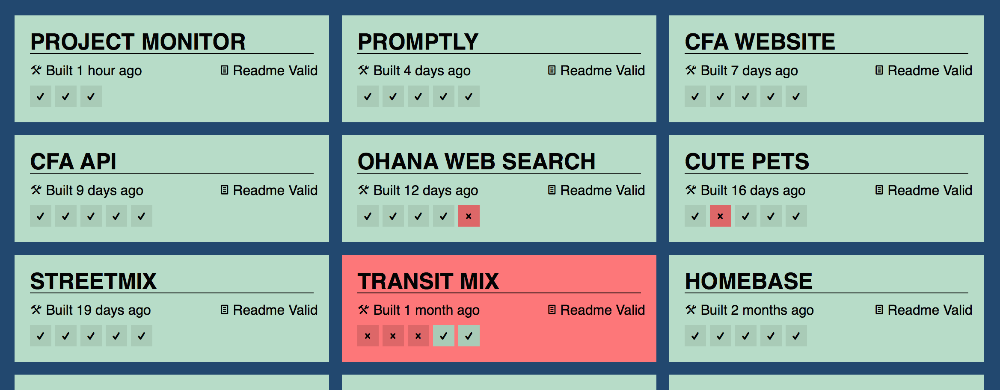

Description
===========

ProjectMonitor is a CI display aggregator. It displays the status of multiple
Continuous Integration builds on a single web page.  The intent is that you
display the page on a big screen monitor or TV so that the status of all your
projects' builds are highly visible/glanceable (a "Big Visible Chart").
ProjectMonitor currently supports only [Travis CI](http://travis-ci.org/).

This project is forked from [pivotal/projectmonitor](https://github.com/pivotal/projectmonitor).
Code for America uses it to show the status of fellowship projects and internal tools.

## Add Your Project

Edit [`projects.json`](projects.json) with your project information via a
Github pull request. You will need three pieces of information:

1. A project display name
2. A unique identifier string
3. A Travis URL for the project

Here is an example:

    {
      "name": "Project Monitor", 
      "guid": "cfa-project-monitor", 
      "travis url": "https://travis-ci.org/codeforamerica/projectmonitor"
    }

The `guid` must be a string of word characters and dashes, matching the regular
expression `^\w+(-\w+)*$`.

Travis will notify Project Monitor of build status
[via web hooks](http://docs.travis-ci.com/user/notifications/#Webhook-notification).
Here is portion of a valid
[Travis configuration file](http://docs.travis-ci.com/user/build-configuration/):

    notifications:
      webhooks: http://project-monitor.codeforamerica.org/projects/cfa-project-monitor/status

## Display
Just open a browser on `/`. The page refreshes every 5 minutes with the latest
status fetched by the cron job or received via Webhook. That is,
refreshing the page doesn't cause the individual builds to be re-polled.

### Layout
The layout consists of a grid of tiles representing the projects.  The
number of projects that need to be displayed is determined automatically.

### Build Statuses
Each project lists the amount of time since the last build in the bottom left corner.
Underneath that is the build status history.  The last 5 builds
are displayed from left to right, in reverse chronological order -- the most
recent build will be on the left and the least recent on the right.
Successful builds are marked with a check mark, and unsuccessful builds
are marked with an x.

### Readme Statuses
For a project's readme to be valid, it must have an installation section or has a section indicating the project has been moved. A valid installation section includes a head with the root word of "Install", "Setup", "Build" or "Deploy". A section indicating the project has moved must include the phrase "Repository has moved". A project can have no readme and still be considered valid if the project is less than a week old.

## Installation

ProjectMonitor is a [Python Flask application](https://github.com/codeforamerica/howto/blob/master/Python-Virtualenv.md).
It relies on [PostreSQL for data storage](https://github.com/codeforamerica/howto/blob/master/PostgreSQL.md).

Copyright (c) 2013 Pivotal Labs / 2014-2015 Code for America.
This software is licensed under the MIT License.

